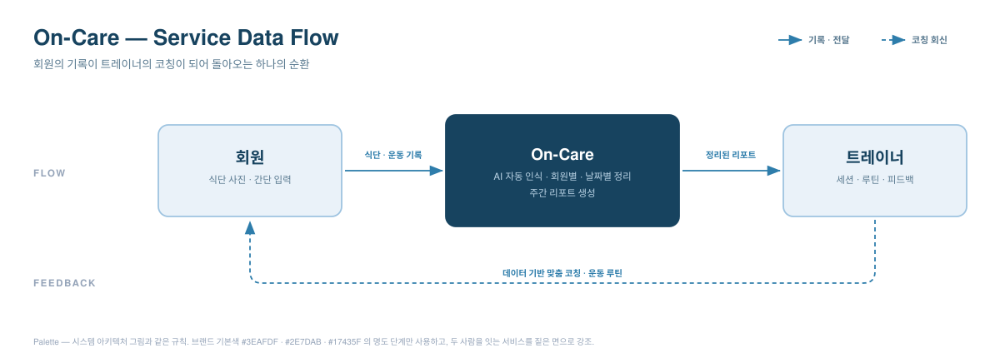
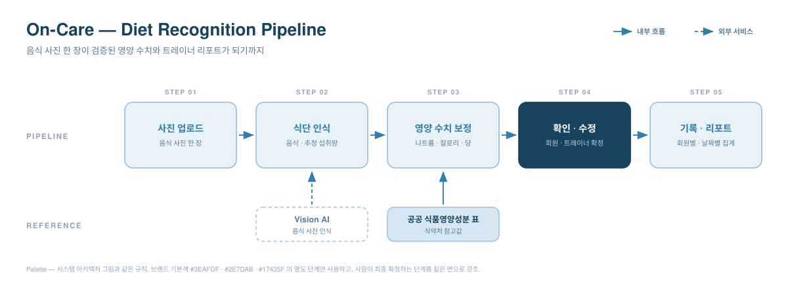
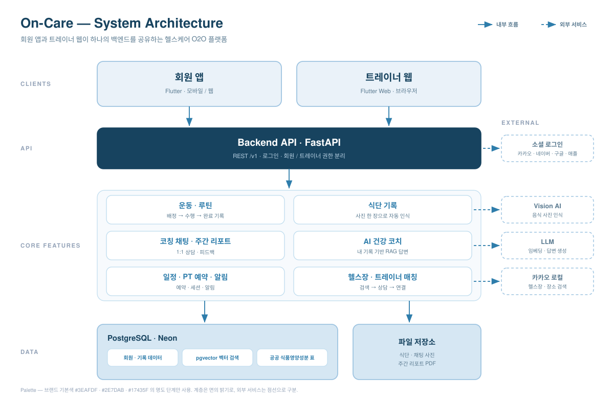

  

# On-care 

***HealthMate AI: 회원·트레이너 연동 식단·운동 관리 서비스 “On-Care”***

  

 

<em><b>On-Care</b> turns scattered trainer–member messaging into data-driven coaching — a member's meals and workouts are auto-organized into daily reports for their trainer, and the trainer's routines flow straight back into the member's app. Built for personal training, where results are decided between sessions.</em>

---

## Overview

**On-Care**는 헬스 트레이너와 회원 사이의 식단·운동 관리 소통을 자동화하는 플랫폼입니다. 회원이 음식 사진 한 장·간단한 입력만 하면 앱이 식단과 운동을 회원별·날짜별로 정리해 트레이너에게 전달하고, 트레이너는 흩어진 메시지를 뒤지는 대신 정리된 리포트 위에서 코칭합니다.

**타깃 유저**는 **PT를 이용하는 회원과 이들을 관리하는 트레이너**입니다. PT의 성과는 주 1~2회 대면 세션이 아니라 **세션과 세션 사이의 식단·운동 관리**에서 갈리지만, 정작 그 구간은 개인 메신저에 맡겨져 있습니다. On-Care는 트레이너의 관리를 세션 밖으로 확장하는 것을 목표로 합니다.

| 구성 | 내용 |
| --- | --- |
| **회원 앱** | Flutter · 모바일 — 식단·운동 기록, AI 건강 코치, 일정·PT 예약, 헬스장·트레이너 찾기 |
| **트레이너 웹** | Flutter Web · 브라우저 — 담당 회원 대시보드, 주간 리포트, 루틴 배정, 1:1 코칭 채팅 |
| **백엔드** | FastAPI 단일 서버 — 두 클라이언트가 같은 API·같은 DB를 공유하고 권한으로 갈립니다 |

---

## Problem

트레이너와 회원 모두 **"기록은 하는데, 그 기록이 관리로 이어지지 않는"** 같은 벽에 부딪힙니다.

| 대상 | 현재 겪는 어려움 |
| --- | --- |
| 🏋️ **트레이너** | 메신저에 흩어진 대화를 뒤지느라, 회원이 늘수록 **관리가 확장되지 않습니다.** |
| 🧍 **회원** | 매 끼 입력이 번거로워 기록을 포기하고, 남긴 기록도 **행동으로 이어지지 않습니다.** |

이 문제를 겨냥한 서비스는 이미 많았지만 정착하지 못했습니다. 회원용 기록 앱과 트레이너용 도구가 **서로 분리되어**, 회원의 데이터가 트레이너에게 정리된 형태로 닿지 않기 때문입니다. 결국 관리는 다시 메신저로 돌아옵니다. On-Care는 바로 이 **끊어진 연결**을 잇습니다.

---

## Background Evidence & Data

문제가 실제로 존재하는지 **직접 물어 확인**한 뒤, 그 결과를 공식 통계·선행 연구와 대조했습니다.

### 자체 설문 2026년 · 온라인 · 응답 57명(PT 경험자 37명)

| | 결과 | 응답 기준 |
| ---: | --- | --- |
| **86%** | 트레이너와의 수업 외 소통을 **개인 메신저**로 한다 | PT 경험자 37명 · 트레이너·헬스장 전용 앱은 8% |
| **78%** | 수업이 없는 날의 식단·운동 관리가 **충분하지 않다** | PT 경험자 · 5점 척도 3점 이하 (평균 2.6점) |
| **79%** | 기록을 트레이너와 공유하고 피드백받는 서비스라면 **쓰겠다** | 전체 57명 · 5점 척도 4점 이상 |

기록할 곳이 없어서 관리가 끊기는 것이 아닙니다. **사진과 대화는 매일 오가지만 기록이 대화 속에 흩어져 관리로 이어지지 않습니다.** 문제(86% · 78%)와 그 해법에 대한 수요(79%)가 같은 응답자 집단에서 함께 확인되었습니다.

### 공식 통계·선행 연구

| | 확인된 사실 | 수치 |
| --- | --- | --- |
| **①** | 헬스는 이미 대중적인 운동이다 — 규칙적 체육활동 참여자의 주 참여 종목 2위 | **17.5%** (1위 걷기 40.5%) |
| **②** | 하지만 지속이 어렵다 — 헬스장 신규 회원 5,240명을 최대 12개월 추적 | **63%가 3개월 이전 중단** · 12개월 이상 4% 미만 |
| **③** | 감독은 순응도와 성과를 가른다 — 저항운동 10주 RCT · 메타분석 | 순응도 **대면 88.2%** · 앱 81.2% · **자율 52.2%** |
| **④** | 기록은 줄지만 피드백이 보완한다 — 자기기록 124명 · 24개월 RCT | 10주 이후 지속 **절반 미만** · 피드백군만 유의한 감소 |

### 그래서 On-Care는

**운동은 시작해도 지속하기 어렵고, 그 과정에서 감독은 순응도와 성과에 영향을 주며, 기록은 시간이 지나며 감소하지만 피드백은 행동 지속을 보조할 수 있습니다.** 그리고 자체 설문에서 확인했듯 그 감독과 피드백은 지금 **기록이 남지 않는 개인 메신저 위에서**, 그것도 드문드문 이루어지고 있습니다. On-Care는 이 근거들 위에 다음 흐름을 설계했습니다.

**회원의 식단·운동 기록 → 자동 정리 → 트레이너 확인 및 코칭 → 회원에게 피드백·프로그램 반영**

트레이너를 AI로 대체하는 것이 아니라, **대면 세션에서 끝나던 트레이너의 관리를 회원의 일상 기록과 연결해 세션 사이까지 이어지게 하는 것**이 On-Care의 핵심입니다.

Sources — 자체 온라인 설문(2026년, 응답 57명 / PT 경험자 37명) ·
<a href="https://www.mcst.go.kr/site/s_policy/subPolicy/sportstour/sportstour29.jsp">2025년 국민생활체육조사, 문화체육관광부</a> ·
<a href="https://pubmed.ncbi.nlm.nih.gov/26874647/">Sperandei et al., <i>Journal of Science and Medicine in Sport</i>, 2016</a> ·
<a href="https://pubmed.ncbi.nlm.nih.gov/40728831/">Gavanda et al., <i>Journal of Strength and Conditioning Research</i>, 2025</a> ·
<a href="https://journal.iusca.org/index.php/Journal/article/view/101">Fisher et al., <i>International Journal of Strength and Conditioning</i>, 2022</a> ·
<a href="https://pubmed.ncbi.nlm.nih.gov/31155473/">Turner-McGrievy et al., <i>Journal of the Academy of Nutrition and Dietetics</i>, 2019</a> ·
<a href="https://pubmed.ncbi.nlm.nih.gov/22704741/">Burke et al., <i>American Journal of Preventive Medicine</i>, 2012</a>

---

## Solution

회원의 기록은 앱 안에서 자동으로 정리되어 트레이너에게 넘어가고, 트레이너의 코칭은 다시 회원에게 돌아옵니다. 회원은 최소한의 노력으로 관리받고, 트레이너는 더 많은 회원을 더 높은 품질로 관리하며, 그 사이의 모든 판단은 감이 아닌 **데이터**를 근거로 이루어집니다.

---

## Key Features

<table>
<thead>
<tr><th width="200">기능</th><th>설명</th></tr>
</thead>
<tbody>
<tr>
<td>📷 <b>간편 식단 기록</b></td>
<td>음식 사진을 찍으면 AI(VLM)가 음식과 양을 추정하고, 식약처 공공 DB의 영양성분 참고값을 조회해 나트륨·칼로리·당 추정치를 제공합니다. 완벽한 자동 계산이 아니라 기록 부담을 없애는 것이 목적이며, <b>최종 값은 회원·트레이너가 확인·보정</b>해 신뢰도를 높입니다.</td>
</tr>
<tr>
<td>🏋️ <b>운동 기록 자동 연동</b></td>
<td>트레이너가 배정한 루틴이 회원 앱에 그대로 뜨고, 수행·완료가 다시 트레이너에게 돌아갑니다. 회원이 일일이 적지 않아도 데이터가 쌓입니다.</td>
</tr>
<tr>
<td>📊 <b>자동 요약 리포트</b></td>
<td>식단·운동·활동을 회원별·날짜별로 묶어 트레이너에게 전달하고 주간 리포트로 내려받게 합니다. <i>"이 회원, 이번 주 나트륨 과다 · 유산소 부족"</i> 을 한눈에 파악합니다.</td>
</tr>
<tr>
<td>💬 <b>1:1 코칭 채팅</b></td>
<td>회원과 담당 트레이너가 같은 기록을 보며 사진까지 주고받습니다. 코칭이 개인 메신저를 떠나 기록 옆에 남습니다.</td>
</tr>
<tr>
<td>🤖 <b>AI 건강 코치</b></td>
<td>공공 가이드라인과 <b>회원 본인의 기록</b>을 근거로 답하는 RAG 코치. 근거 없는 일반론 대신 "내 데이터에 비춘" 답을 돌려주고, 의료 판단은 하지 않습니다.</td>
</tr>
<tr>
<td>🔗 <b>데이터 기반 매칭</b></td>
<td>회원의 목표와 조건(지역·시간·성향)에 맞춰 트레이너·헬스장을 추천하고, 상담부터 연결까지 앱 안에서 끝냅니다.</td>
</tr>
<tr>
<td>🎯 <b>목표·미션 관리</b></td>
<td>회원의 목표에 맞춘 영양·활동량 목표와 일일 미션. 많이 먹은 날은 활동량을, 적게 먹은 날은 식단을 조정하는 <b>식단↔운동 연동 코칭</b>을 제공합니다.</td>
</tr>
</tbody>
</table>

---

## Diet Recognition Pipeline

사진에서 시작해 Vision AI가 음식과 양을 추정하고, **식약처 공공 영양성분 참고값**으로 추정치를 보정한 뒤, 구조화된 기록과 트레이너 리포트로 이어집니다. 마지막 값을 확정하는 것은 AI가 아니라 **회원과 트레이너**입니다.

---

## System Architecture

회원 앱과 트레이너 웹은 **하나의 FastAPI 백엔드**를 공유하고, 권한으로 갈라집니다. 회원의 기록이 트레이너에게 정리되어 닿는 흐름 자체가 이 구조 위에서 성립합니다.

---

## Tech Stack

<table>
<thead>
<tr><th width="130">영역</th><th>사용 기술</th></tr>
</thead>
<tbody>
<tr><td><b>Frontend</b></td><td>Flutter · Dart · Riverpod · GoRouter (회원 앱(모바일) · 트레이너 웹 — 분리된 코드베이스, 아키텍처 패턴 미러링)</td></tr>
<tr><td><b>Backend</b></td><td>FastAPI · SQLAlchemy · Alembic · JWT · Docker</td></tr>
<tr><td><b>Database</b></td><td>PostgreSQL (Neon) · pgvector · 서버 파일 저장소(식단·채팅 이미지, 주간 리포트 PDF)</td></tr>
<tr><td><b>AI</b></td><td>Vision AI(VLM) 식단 인식 · LLM 코칭 · 임베딩 모델(768차원) + pgvector 벡터 검색 기반 RAG · 식약처 공공 영양성분 DB 매칭</td></tr>
<tr><td><b>Infra</b></td><td>백엔드 AWS ECR + App Runner · 프론트 GitHub Pages(커스텀 도메인) · GitHub Actions (CI/CD)</td></tr>
<tr><td><b>External API</b></td><td>카카오 (지도 JS SDK · 로컬 장소 검색) · 소셜 로그인 (카카오 · 네이버 · 구글 · 애플) · 공공데이터포털 (식약처 영양성분)</td></tr>
</tbody>
</table>

> **AI 제공자 API 키가 없어도** 개발·CI가 멈추지 않습니다. 키가 비어 있으면 식단 인식은 오프라인 스텁으로, 임베딩·코치는 해시·규칙 폴백으로 자동 전환됩니다.

---

## Repository Structure

<table>
<thead>
<tr><th width="240">경로</th><th>내용</th></tr>
</thead>
<tbody>
<tr><td><code>backend/</code></td><td>FastAPI · SQLAlchemy · Alembic · PostgreSQL(pgvector) — 두 클라이언트가 공유하는 단일 API</td></tr>
<tr><td><code>frontend/flutter/</code></td><td>회원 앱 (모바일)</td></tr>
<tr><td><code>frontend/flutter_trainer/</code></td><td>트레이너 웹 (Flutter Web)</td></tr>
<tr><td><code>infra/</code></td><td>배포용 CloudFormation 템플릿</td></tr>
<tr><td><code>docs/</code></td><td>현행 문서</td></tr>
<tr><td><code>docs/archive/</code></td><td>캡스톤 스타트 단계 보존용 기록 — <b>현재 기준이 아님</b></td></tr>
<tr><td><code>index.html</code></td><td>소개 페이지 (GitHub Pages)</td></tr>
</tbody>
</table>

---

## Competitive Analysis

| 항목 | 필라이즈 | 밀리그램·인아웃 | **On-Care** |
| --- | :---: | :---: | :---: |
| **식단 기록** | 사진 AI 인식 | 사진·빠른 입력 | **사진 → 공공 영양 DB 매칭** |
| **트레이너 연동** | 앱 내 AI 코치만 | 없음 | **회원 데이터 자동 정리 → 트레이너 전달** |
| **회원 관리 확장성** | 없음 | 없음 | **1인이 다수 회원을 데이터로 관리** |
| **세션 밖 코칭** | AI 응답만 | 없음 | **담당 트레이너의 실제 코칭이 앱으로 연장** |
| **데이터 흐름** | 개인 앱 내 완결 | 개인 앱 내 완결 | **회원 ↔ 트레이너 양방향** |

> 기존 서비스는 회원 개인의 기록에서 끝납니다. On-Care는 그 기록을 **트레이너의 코칭 자원으로 연결**하는 흐름 자체가 차별점입니다.

---

## Target &amp; Business Model

On-Care의 **핵심 타깃**은 **PT를 이용하는 회원과 이들을 관리하는 트레이너**입니다. 회원은 이미 PT에 비용을 지불하고 있는 층이라 관리 품질에 대한 지불 의사가 높고, 트레이너는 담당 회원 수가 곧 수익인 만큼 **관리 효율을 높이는 도구에 직접적인 구매 동기**를 가집니다.

| 구분 | 모델 |
| --- | --- |
| **메인** | 트레이너·헬스장 **중개 수수료 / 구매 전환 커미션** · 트레이너용 **고도화 기능 구독** |
| **프리미엄** | 기본 기능은 무료로 진입장벽을 낮추고, 가치를 체감한 사용자가 고도화 기능을 결제 |
| **부수** | 광고(상위 노출 등)는 보조 수입으로만 |

> **확장 방향** — PT에서 자리 잡은 뒤에는 같은 구조(전문가가 개인의 생활 관리를 지속적으로 지도하는 관계)를 필라테스·요가 스튜디오, 기업 임직원 건강관리, 재활·시니어 운동 지도로 넓힐 수 있습니다.

---

## Team

|                                                         최지수                                                          |                                                            박서연                                                            |                                                           신수빈                                                           |
|:--------------------------------------------------------------------------------------------------------------------:|:-------------------------------------------------------------------------------------------------------------------------:|:-----------------------------------------------------------------------------------------------------------------------:|
|  |  |  |
|                                         [@aJISUa](https://github.com/aJISUa)                                         |                                      [@seoyeon0516](https://github.com/seoyeon0516)                                       |                                       [@subin21cc](https://github.com/subin21cc)                                        |

> *지도교수: 황의원 교수님 (이화여자대학교 · 컴퓨터공학전공)*

---

## License

본 프로젝트는 [MIT License](LICENSE) 하에 배포됩니다. 자세한 내용은 [`LICENSE`](LICENSE) 파일을 참고하세요.

> Copyright © 2026 On-Care Team (CSE-Sudo: 최지수 · 박서연 · 신수빈)

 

---

**2026 이화여자대학교 캡스톤디자인**

*Team 02 Sudo — Jisu Choi · Seoyeon Park · Subin Shin*

